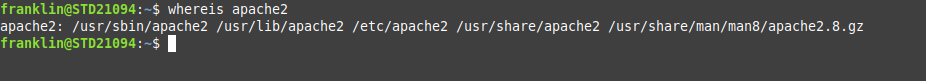
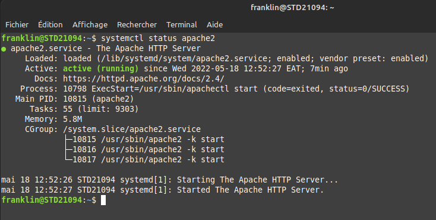

# Création d'un serveur apache sur Linux.

## installion:

$ sudo apt update

$ sudo apt install apache2

## verification :

$ whereis apache2

cette commande retourne le chemin vers l'installation d'apache2

## Lancement du serveur:
$ sudo systemctl start apache2

## verification du serveur : 
$ sudo systemctl status apache2

Ouvrer votre navigateur, sur la barre d'adresse taper: localhost:80

