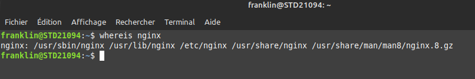
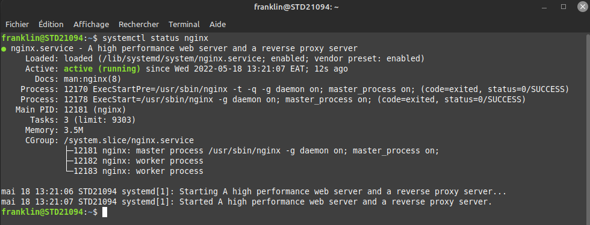
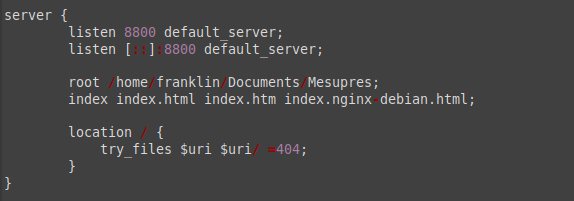

# Création d'un serveur nginx sur Linux.

## installion:

$ sudo apt update

$ sudo apt install nginx

## verification :

$ whereis nginx

cette commande retourne le chemin vers l'installation d'nginx

## Lancement du serveur:
$ sudo systemctl start nginx

## verification du serveur : 
$ sudo systemctl status nginx

## Configurer un nouveau server

Copier le parametre suivant dans votre fichier default qui se trouve dans le dossier:
/etc/nginx/sites-enabled/

redemarer le serveur en tapant : 

$ sudo systemctl restart nginx

Ouvrer votre navigateur, sur la barre d'adresse taper: localhost:8800

