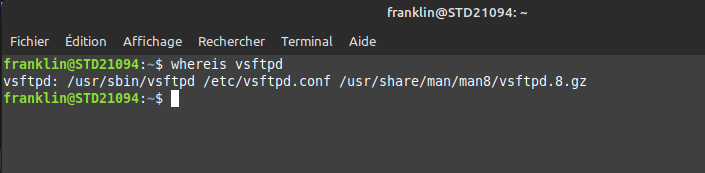
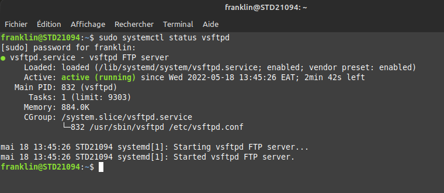
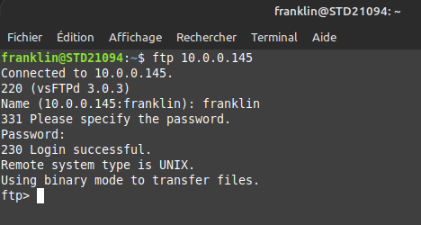

# Création d'un serveur vsftpd sur Linux.

## installion:

$ sudo apt update

$ sudo apt install vsftpd

## verification :

$ whereis vsftpd

cette commande retourne le chemin vers l'installation de vsftpd

## Lancement du serveur:
$ sudo systemctl start nginx

## verification du serveur : 
$ sudo systemctl status vsftpd

## Connection aux sevreur vsftpd

$ ftp "votre address ip"

puit entre votre nom d'utilisateur et votre mot de passe local.

